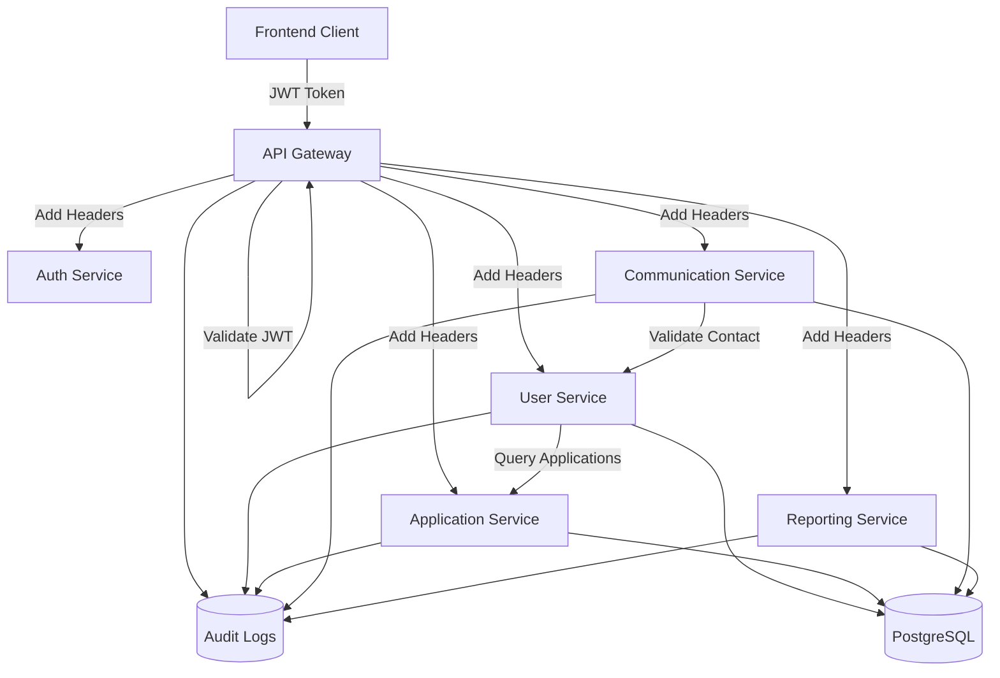
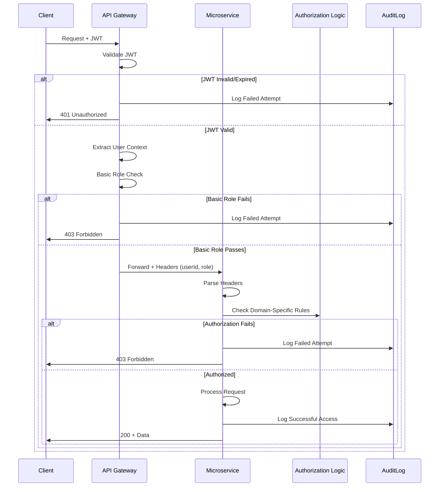
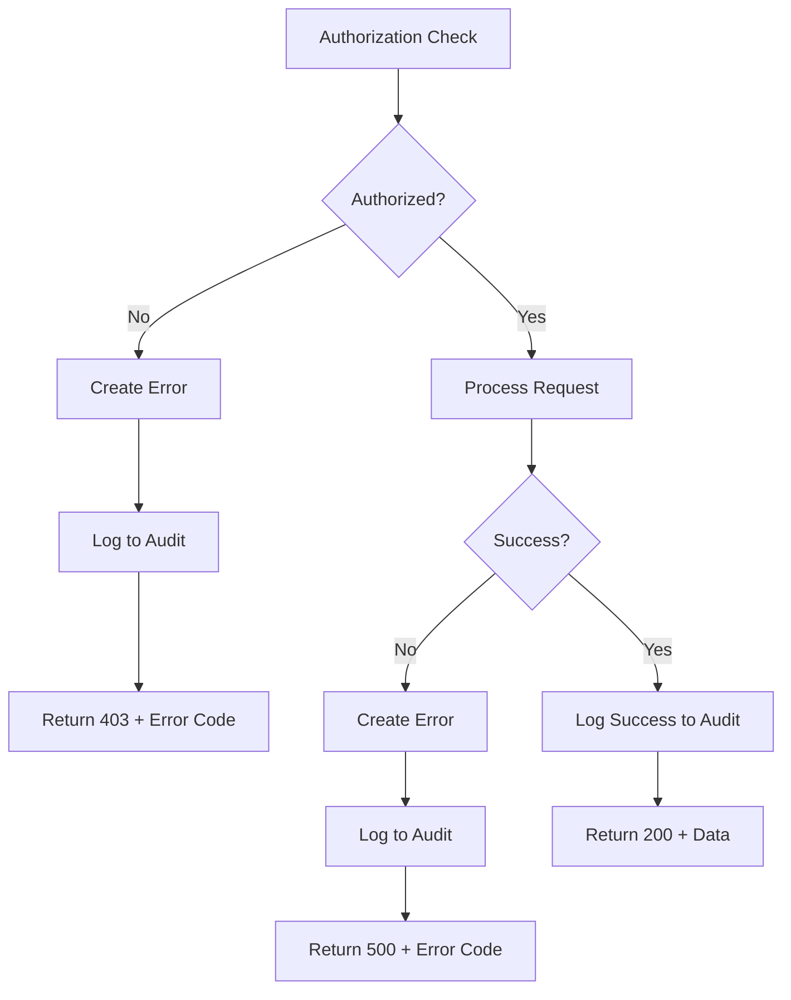

# Design Document: Access Control Validation Rules

## Overview

This design implements a comprehensive access control validation system for the HandiTalents platform that enforces privacy and authorization rules across microservices. The system follows a **defense-in-depth** approach with validation at multiple layers: API Gateway (preliminary checks), individual microservices (authoritative checks), and audit logging (monitoring and compliance).

The core design principle is that **the API Gateway provides fast-fail validation** for obvious authorization violations (invalid tokens, basic role checks), while **each microservice maintains authoritative control** over its domain-specific authorization logic (e.g., "does this enterprise own this job offer?"). This approach balances performance, security, and service autonomy.

### Key Design Goals

1. **Privacy Protection**: Prevent unauthorized access to candidate CVs and personal data
2. **Role-Based Access Control (RBAC)**: Enforce strict role boundaries (Enterprise, Candidate, Inspector, Admin)
3. **Defense-in-Depth**: Multiple validation layers to prevent bypasses
4. **Audit Trail**: Complete logging of sensitive data access for compliance
5. **Service Autonomy**: Each microservice owns its authorization decisions
6. **Performance**: Fast-fail at gateway to reduce unnecessary service calls

### Architecture Principles

- **Zero Trust**: Every request must be validated, even internal service-to-service calls
- **Fail Secure**: Default to deny access unless explicitly authorized
- **Audit Everything**: Log all access attempts to sensitive resources
- **Stateless Authorization**: All authorization context passed in request headers
- **Service Isolation**: Services validate independently without cross-service dependencies where possible

## Architecture

### System Overview



### Authorization Flow



### Request Context Propagation

Every request flowing through the API Gateway will be enriched with the following headers before being forwarded to microservices:

| Header | Description | Example |
|--------|-------------|---------|
| `X-User-Id` | Unique identifier of the authenticated user | `550e8400-e29b-41d4-a716-446655440000` |
| `X-User-Role` | Role of the user | `ENTREPRISE`, `CANDIDAT`, `INSPECTEUR`, `ADMIN` |
| `X-User-Entity-Id` | Entity-specific ID (candidate_id, enterprise_id, etc.) | `123e4567-e89b-12d3-a456-426614174000` |
| `X-Request-Id` | Unique request identifier for tracing | `req_abc123xyz` |

**Security Note**: These headers are injected by the API Gateway after JWT validation. Services MUST NOT trust these headers if they come directly from external clients - the gateway must strip any pre-existing X-User-* headers from incoming requests.

## Components and Interfaces

### 1. API Gateway Validation Middleware

The API Gateway will implement a new middleware stack for JWT validation and preliminary authorization checks.

#### JWT Validation Middleware

**Location**: `microservices/api-gateway/src/middleware/jwt-validation.middleware.ts`

**Responsibilities**:
- Extract JWT token from `Authorization` header
- Verify token signature and expiration using shared JWT secret
- Reject requests with invalid/expired tokens (401)
- Parse JWT payload to extract user context
- Inject user context into request headers for downstream services

**Interface**:

```typescript
interface JwtValidationMiddleware {
  (req: Request, res: Response, next: NextFunction): void;
}

interface ParsedJwtPayload {
  id_utilisateur: string;
  email: string;
  role: RoleUtilisateur;
  candidat?: { id: string };
  entreprise?: { id: string };
  admin?: { id: string };
}
```

**Error Responses**:
- Missing token: `401 { "error": "Token d'authentification manquant" }`
- Invalid token: `401 { "error": "Token invalide ou expiré" }`

#### Role-Based Route Guards

**Location**: `microservices/api-gateway/src/middleware/role-guard.middleware.ts`

**Responsibilities**:
- Enforce role-based access for specific route patterns
- Block obviously unauthorized requests before they reach services
- Examples: Inspectors cannot access `/api/chat/*`, Enterprises cannot access `/api/supervision/*`

**Configuration**: Route guards defined in configuration object:

```typescript
interface RouteGuard {
  pattern: RegExp;
  allowedRoles: RoleUtilisateur[];
  denyMessage?: string;
}

const ROUTE_GUARDS: RouteGuard[] = [
  {
    pattern: /^\/api\/supervision/,
    allowedRoles: ['INSPECTEUR', 'ADMIN'],
    denyMessage: 'Accès réservé aux inspecteurs et administrateurs'
  },
  {
    pattern: /^\/api\/chat/,
    allowedRoles: ['CANDIDAT', 'ENTREPRISE', 'ADMIN'],
    denyMessage: 'Les inspecteurs ne peuvent pas accéder aux messageries'
  }
];
```

#### Audit Logging Middleware

**Location**: `microservices/api-gateway/src/middleware/audit-log.middleware.ts`

**Responsibilities**:
- Log all denied access attempts at the gateway level
- Include request metadata for security monitoring

**Log Format**:

```typescript
interface GatewayAuditLog {
  timestamp: Date;
  requestId: string;
  userId: string;
  userRole: string;
  path: string;
  method: string;
  denialReason: 'INVALID_TOKEN' | 'ROLE_FORBIDDEN';
  ipAddress: string;
}
```

### 2. Service-Level Authorization

Each microservice implements domain-specific authorization logic using a consistent pattern.

#### Authorization Service Layer

**Pattern**: Each service will have an `authorization.service.ts` module that encapsulates authorization logic.

**Example - User Service**: `microservices/user-service/src/services/authorization.service.ts`

```typescript
interface CvAccessAuthorizationService {
  /**
   * Check if a user can access a candidate's CV
   * @param requesterId - ID of the user requesting access
   * @param requesterRole - Role of the requester
   * @param candidateId - ID of the candidate whose CV is being accessed
   * @returns Authorization decision
   */
  canAccessCv(
    requesterId: string,
    requesterRole: RoleUtilisateur,
    candidateId: string
  ): Promise<AuthorizationResult>;
}

interface AuthorizationResult {
  allowed: boolean;
  reason?: string;
  requiresApplication?: boolean;
}
```

**Authorization Rules (User Service - CV Access)**:

1. **Admin**: Always allowed
2. **Candidate accessing own CV**: Always allowed
3. **Enterprise accessing candidate CV**:
   - Query Application Service to check if candidate has applied to any of enterprise's jobs
   - Allow if ≥1 application exists (active or historical)
   - Deny otherwise
4. **Inspector**: Always denied
5. **All other cases**: Denied

#### Inter-Service Authorization Queries

When a service needs data from another service to make an authorization decision, it uses **internal HTTP endpoints** not exposed via the API Gateway.

**Example - User Service querying Application Service**:

**Internal Endpoint**: `GET /internal/applications/check-relationship`

**Request**:
```typescript
interface ApplicationRelationshipQuery {
  candidateId: string;
  enterpriseId: string;
}
```

**Response**:
```typescript
interface ApplicationRelationshipResult {
  hasRelationship: boolean;
  applicationCount: number;
  latestApplicationDate?: Date;
}
```

**Security**: Internal endpoints:
- Listen on a separate internal port (e.g., 4204 for application-service-internal)
- NOT exposed through API Gateway
- Authenticated using service-to-service tokens (future enhancement: mutual TLS)
- Rate-limited to prevent abuse

**Alternative Design Considered**: Shared database access - Rejected because it violates microservice boundaries and creates tight coupling.

### 3. Communication Service Authorization

**Location**: `microservices/communication-service/src/services/contact-authorization.service.ts`

**Rules**:

```typescript
interface ContactAuthorizationRules {
  /**
   * Check if sender can initiate contact with recipient
   */
  canInitiateContact(
    senderId: string,
    senderRole: RoleUtilisateur,
    recipientId: string,
    recipientRole: RoleUtilisateur
  ): AuthorizationResult;
}
```

**Implementation Logic**:

| Sender Role | Recipient Role | Allowed? | Reason |
|-------------|----------------|----------|--------|
| ENTREPRISE | ENTREPRISE | ❌ No | Business-to-business contact forbidden |
| ENTREPRISE | CANDIDAT | ✅ Yes | Recruitment communication |
| ENTREPRISE | ADMIN | ✅ Yes | Support communication |
| CANDIDAT | ENTREPRISE | ✅ Yes | Job inquiry |
| CANDIDAT | CANDIDAT | ✅ Yes | Peer communication |
| CANDIDAT | ADMIN | ✅ Yes | Support communication |
| INSPECTEUR | * | ❌ No | Inspectors use read-only reporting interface |
| ADMIN | * | ✅ Yes | Admin can communicate with anyone |

**Recipient Search Filter**: When enterprises search for message recipients, the service filters out all enterprise accounts from results.

### 4. Application Service Authorization

**Location**: `microservices/application-service/src/services/authorization.service.ts`

**Rules**:

```typescript
interface ApplicationAccessAuthorizationService {
  /**
   * Check if user can access applications for a job offer
   */
  canAccessApplications(
    userId: string,
    userRole: RoleUtilisateur,
    jobOfferId: string
  ): Promise<AuthorizationResult>;
}
```

**Implementation Logic**:

1. **Admin**: Always allowed
2. **Candidate**: Can only access their own applications (filter by candidate_id)
3. **Enterprise**: 
   - Query database to verify enterprise owns the job offer
   - Allow if job belongs to enterprise
   - Deny otherwise
4. **Inspector**: Denied (inspectors use reporting service for aggregated stats)

### 5. Reporting Service Authorization

**Location**: `microservices/reporting-service/src/services/authorization.service.ts`

The Reporting Service provides aggregated, anonymized views for inspectors while preventing access to personal data.

**Inspector Access Rules**:

| Resource | Access Level | Restrictions |
|----------|--------------|--------------|
| Enterprise list | ✅ Full access | Public enterprise profiles |
| Job offers | ✅ Full access | Including view counts |
| Recruited candidates | ✅ Aggregated only | Names/titles only, NO CVs |
| Application statistics | ✅ Aggregated only | Counts and percentages, NO individual applications |
| Candidate profiles | ❌ No access | Forbidden |
| CVs | ❌ No access | Forbidden |
| Messages | ❌ No access | Forbidden |

**Data Transformation**: When returning recruited candidate lists to inspectors, the service strips sensitive fields:

```typescript
interface RecruitedCandidateForInspector {
  id: string;
  firstName: string;  // First name only
  jobTitle: string;
  recruitmentDate: Date;
  enterpriseId: string;
  // CV, full profile, contact info EXCLUDED
}
```

## Data Models

### Audit Log Schema

All services write to a shared audit log table for centralized monitoring and compliance.

**Table**: `audit_logs`

```sql
CREATE TABLE audit_logs (
  id UUID PRIMARY KEY DEFAULT gen_random_uuid(),
  timestamp TIMESTAMPTZ NOT NULL DEFAULT NOW(),
  request_id VARCHAR(100),
  
  -- User Context
  user_id UUID NOT NULL,
  user_role VARCHAR(50) NOT NULL,
  user_email VARCHAR(255),
  
  -- Request Details
  service_name VARCHAR(100) NOT NULL,
  action_type VARCHAR(100) NOT NULL,  -- 'CV_ACCESS', 'CONTACT_INITIATION', 'APPLICATION_ACCESS'
  resource_type VARCHAR(100),         -- 'CV', 'MESSAGE', 'APPLICATION'
  resource_id UUID,
  
  -- Authorization Result
  authorization_result VARCHAR(20) NOT NULL,  -- 'ALLOWED', 'DENIED'
  denial_reason TEXT,
  
  -- Request Metadata
  http_method VARCHAR(10),
  http_path TEXT,
  ip_address INET,
  user_agent TEXT,
  
  -- Contextual Data (JSON for flexibility)
  additional_context JSONB,
  
  -- Indexes for querying
  INDEX idx_audit_timestamp (timestamp),
  INDEX idx_audit_user (user_id),
  INDEX idx_audit_action (action_type),
  INDEX idx_audit_result (authorization_result)
);
```

**Example Audit Log Entry**:

```json
{
  "id": "a0eebc99-9c0b-4ef8-bb6d-6bb9bd380a11",
  "timestamp": "2025-01-15T14:32:11.234Z",
  "request_id": "req_abc123",
  "user_id": "550e8400-e29b-41d4-a716-446655440000",
  "user_role": "ENTREPRISE",
  "user_email": "hr@company.com",
  "service_name": "user-service",
  "action_type": "CV_ACCESS",
  "resource_type": "CV",
  "resource_id": "123e4567-e89b-12d3-a456-426614174000",
  "authorization_result": "DENIED",
  "denial_reason": "No application relationship exists between enterprise and candidate",
  "http_method": "GET",
  "http_path": "/api/candidats/profil/123e4567-e89b-12d3-a456-426614174000/cv",
  "ip_address": "192.168.1.100",
  "additional_context": {
    "enterprise_id": "ent_789",
    "application_check_result": {
      "hasRelationship": false,
      "applicationCount": 0
    }
  }
}
```

### Authorization Cache (Optional Future Enhancement)

To reduce inter-service calls, authorization decisions can be cached:

**Table**: `authorization_cache`

```sql
CREATE TABLE authorization_cache (
  id UUID PRIMARY KEY DEFAULT gen_random_uuid(),
  cache_key VARCHAR(500) NOT NULL UNIQUE,  -- e.g., "cv_access:ent_123:candidate_456"
  authorization_result BOOLEAN NOT NULL,
  created_at TIMESTAMPTZ NOT NULL DEFAULT NOW(),
  expires_at TIMESTAMPTZ NOT NULL,
  context_hash VARCHAR(64),  -- SHA256 of context used for decision
  
  INDEX idx_cache_key (cache_key),
  INDEX idx_expires_at (expires_at)
);
```

**Cache Invalidation Strategy**:
- TTL: 5 minutes for CV access decisions
- Invalidate on application creation/deletion
- Invalidate on user role changes

**Note**: Cache implementation is deferred to Phase 2 to avoid premature optimization.

## Security Patterns and Defense-in-Depth

### Layer 1: API Gateway (Fast-Fail)

**Purpose**: Block obviously invalid requests before they consume service resources.

**Checks**:
1. JWT token presence and validity
2. Token expiration
3. Basic role-based route access (e.g., inspectors can't access /api/chat)

**Does NOT check**: Domain-specific rules (e.g., "does this enterprise own this job?")

### Layer 2: Microservice Authorization (Authoritative)

**Purpose**: Make the final, authoritative authorization decision based on domain logic.

**Checks**:
1. Re-validate user context from headers
2. Query database/other services as needed
3. Apply domain-specific business rules
4. Make allow/deny decision

**Key Principle**: **Never trust the gateway alone**. Services must validate independently because:
- Gateway could be bypassed in internal networks
- Gateway logic could have bugs
- Defense-in-depth requires redundancy

### Layer 3: Audit Logging (Detective Control)

**Purpose**: Detect and investigate unauthorized access attempts or policy violations.

**Capabilities**:
1. Real-time alerting on suspicious patterns (e.g., 100 denied CV access attempts in 1 minute)
2. Compliance reporting (GDPR data access audits)
3. Forensic investigation of security incidents
4. User behavior analytics

### Header Injection Security

**Threat**: Malicious client sends forged `X-User-Id` header to bypass authorization.

**Mitigation**:

```typescript
// API Gateway: Strip dangerous headers from incoming requests
app.use((req, res, next) => {
  // Remove any X-User-* headers sent by client
  Object.keys(req.headers).forEach(header => {
    if (header.toLowerCase().startsWith('x-user-')) {
      delete req.headers[header];
    }
  });
  next();
});

// Then inject validated headers after JWT verification
```

**Service-Side Validation**:

```typescript
// Services: Validate headers are present (gateway must have set them)
const validateGatewayHeaders = (req: Request): UserContext => {
  const userId = req.headers['x-user-id'];
  const userRole = req.headers['x-user-role'];
  
  if (!userId || !userRole) {
    throw new UnauthorizedError('Request must come through API Gateway');
  }
  
  return { userId, userRole };
};
```

### Inter-Service Communication Security

**Current State**: Services communicate over HTTP with no authentication.

**Security Enhancement (Future)**:

1. **Service-to-Service Tokens**: Internal endpoints require a shared secret or service-specific JWT
2. **Mutual TLS (mTLS)**: Services authenticate each other using certificates
3. **Network Segmentation**: Internal endpoints listen on private network only

**Immediate Mitigation**: Internal endpoints are not exposed through API Gateway and are rate-limited.

### SQL Injection Prevention

All database queries use parameterized statements:

```typescript
// SAFE: Parameterized query
const applications = await db.query(
  'SELECT * FROM applications WHERE candidate_id = $1 AND enterprise_id = $2',
  [candidateId, enterpriseId]
);

// UNSAFE: String concatenation (NEVER DO THIS)
const applications = await db.query(
  `SELECT * FROM applications WHERE candidate_id = '${candidateId}'`
);
```

### Rate Limiting

To prevent abuse and brute-force authorization attempts:

**API Gateway Level**:
- 1000 requests per minute per IP address
- 100 requests per minute per user (authenticated)

**Service Level (Internal Endpoints)**:
- 100 requests per minute per calling service

### GDPR Compliance

**Right to Access**: Audit logs provide complete record of who accessed a candidate's data.

**Right to Erasure**: When a candidate deletes their account:
1. CV and personal data deleted from user-service
2. Audit logs RETAINED (anonymized: replace user_id with "DELETED_USER_<hash>")
3. Rationale: Audit logs required for security and legal compliance

**Data Minimization**: Reporting service returns only aggregated data to inspectors, minimizing exposure.

## Correctness Properties

*A property is a characteristic or behavior that should hold true across all valid executions of a system—essentially, a formal statement about what the system should do. Properties serve as the bridge between human-readable specifications and machine-verifiable correctness guarantees.*

**Property Reflection:**

After analyzing all acceptance criteria, I identified the following potential properties and performed consolidation to eliminate redundancy:

**Redundancy Analysis**:
- Requirements 1.1, 1.2, 1.5, 1.6 all test contact authorization rules → Combined into Property 1
- Requirements 2.1, 2.2, 2.3, 2.4, 2.5 all test CV access authorization rules → Combined into Property 2
- Requirements 4.1, 4.2 both test JWT validation → Combined into Property 5
- Requirements 5.1, 5.2, 5.3, 5.4, 5.5 all test application access authorization → Combined into Property 7
- Requirements 6.1, 6.2, 6.3, 6.6 all test audit logging completeness → Combined into Property 9

This consolidation reduces 11 initially identified properties to 9 comprehensive properties, each providing unique validation value.

### Property 1: Contact Authorization Rules

*For any* pair of users (sender and recipient) with their respective roles, the contact authorization logic SHALL correctly allow or deny contact initiation based on role combinations, specifically:
- Enterprise-to-Enterprise contacts SHALL be denied
- Enterprise-to-Candidate contacts SHALL be allowed
- Enterprise-to-Admin contacts SHALL be allowed
- Candidate-to-any contacts SHALL be allowed
- Admin-to-any contacts SHALL be allowed
- Inspector-to-any contacts SHALL be denied

**Validates: Requirements 1.1, 1.2, 1.5, 1.6**

### Property 2: CV Access Authorization Rules

*For any* combination of requester (with userId and role) and candidate CV, the CV access authorization logic SHALL correctly allow or deny access based on these rules:
- Admin users SHALL always be granted access
- Candidates accessing their own CV SHALL always be granted access
- Enterprise users SHALL be granted access if and only if an application relationship exists between the enterprise and candidate
- Inspector users SHALL always be denied access
- All other roles SHALL be denied access

**Validates: Requirements 2.1, 2.2, 2.3, 2.4, 2.5, 3.5**

### Property 3: Enterprise Recipient Filtering

*For any* list of users containing a mix of roles, when an enterprise user performs a recipient search, the returned results SHALL exclude all users with the ENTREPRISE role while retaining all other roles.

**Validates: Requirements 1.4**

### Property 4: Inspector Data Sanitization

*For any* list of recruited candidate records containing CV data and personal information, when returned to an inspector, the response SHALL exclude all CV fields and sensitive personal data while retaining only aggregate information (name, job title, recruitment date).

**Validates: Requirements 3.4**

### Property 5: JWT Validation Correctness

*For any* JWT token (valid, expired, malformed, or with invalid signature), the API Gateway JWT validation middleware SHALL:
- Accept and parse valid, non-expired tokens with correct signatures
- Reject expired tokens with 401 status
- Reject malformed tokens with 401 status
- Reject tokens with invalid signatures with 401 status

**Validates: Requirements 4.1, 4.2**

### Property 6: Route Guard Enforcement

*For any* route guard configuration (pattern and allowed roles) and incoming request (path and user role), the API Gateway route guard middleware SHALL correctly allow requests where the user role is in the allowed roles list and deny requests where the user role is not in the allowed roles list.

**Validates: Requirements 4.4**

### Property 7: Application Access Authorization Rules

*For any* combination of requester (with userId and role) and job offer ID, the application access authorization logic SHALL correctly allow or deny access based on these rules:
- Admin users SHALL always be granted access
- Candidate users SHALL be granted access only to their own applications
- Enterprise users SHALL be granted access if and only if the enterprise owns the job offer
- Inspector users SHALL always be denied access
- All other roles SHALL be denied access

**Validates: Requirements 5.1, 5.2, 5.3, 5.4, 5.5**

### Property 8: Gateway Access Denial Logging

*For any* request denied by the API Gateway (due to invalid token or role restrictions), an audit log entry SHALL be created containing all required fields: timestamp, requestId, userId, userRole, path, method, denialReason, and ipAddress.

**Validates: Requirements 4.5**

### Property 9: Service-Level Audit Logging Completeness

*For any* authorization attempt at the service level (CV access, contact initiation, or application access), an audit log entry SHALL be created containing all required fields: timestamp, requestId, userId, userRole, serviceName, actionType, resourceType, resourceId, authorizationResult, and contextual metadata.

**Validates: Requirements 6.1, 6.2, 6.3, 6.6**

### Property 10: Audit Log Query Filtering

*For any* set of audit log entries and any filter criteria (userId, date range, actionType), the audit log query API SHALL return only entries that match ALL specified filter criteria.

**Validates: Requirements 6.4**

## Error Handling

### Error Response Format

All services follow a consistent error response format:

```typescript
interface ErrorResponse {
  error: string;           // Human-readable error message
  code: string;            // Machine-readable error code
  statusCode: number;      // HTTP status code
  requestId?: string;      // For tracing
  details?: unknown;       // Additional context (not exposed in production)
}
```

### Error Categories

| HTTP Status | Error Type | Use Case | Example |
|-------------|------------|----------|---------|
| 401 | Authentication Error | Invalid/expired JWT, missing token | `{ error: "Token invalide ou expiré", code: "AUTH_INVALID_TOKEN" }` |
| 403 | Authorization Error | Valid user but insufficient permissions | `{ error: "Accès refusé: aucune candidature trouvée", code: "AUTHZ_NO_APPLICATION_RELATIONSHIP" }` |
| 404 | Resource Not Found | Requested resource doesn't exist | `{ error: "CV non trouvé", code: "RESOURCE_NOT_FOUND" }` |
| 429 | Rate Limit Exceeded | Too many requests | `{ error: "Trop de requêtes", code: "RATE_LIMIT_EXCEEDED" }` |
| 500 | Internal Server Error | Unexpected service error | `{ error: "Erreur interne du serveur", code: "INTERNAL_ERROR" }` |

### Authorization-Specific Error Codes

```typescript
enum AuthorizationErrorCode {
  // CV Access
  CV_NO_APPLICATION_RELATIONSHIP = 'AUTHZ_CV_NO_APPLICATION_RELATIONSHIP',
  CV_INSPECTOR_FORBIDDEN = 'AUTHZ_CV_INSPECTOR_FORBIDDEN',
  
  // Contact
  CONTACT_ENTERPRISE_TO_ENTERPRISE = 'AUTHZ_CONTACT_ENTERPRISE_TO_ENTERPRISE',
  CONTACT_INSPECTOR_FORBIDDEN = 'AUTHZ_CONTACT_INSPECTOR_FORBIDDEN',
  
  // Applications
  APP_NOT_OWNER = 'AUTHZ_APP_NOT_OWNER',
  APP_INSPECTOR_FORBIDDEN = 'AUTHZ_APP_INSPECTOR_FORBIDDEN',
  
  // Generic
  INVALID_ROLE = 'AUTHZ_INVALID_ROLE',
  RESOURCE_NOT_FOUND = 'AUTHZ_RESOURCE_NOT_FOUND',
}
```

### Error Handling Flow



### Graceful Degradation

When authorization checks depend on external services (e.g., User Service checking Application Service):

**Strategy**: Fail secure (deny access) if dependent service is unavailable.

```typescript
async function checkApplicationRelationship(
  candidateId: string,
  enterpriseId: string
): Promise<boolean> {
  try {
    const response = await httpClient.get(
      `${applicationServiceUrl}/internal/applications/check-relationship`,
      { params: { candidateId, enterpriseId }, timeout: 2000 }
    );
    return response.data.hasRelationship;
  } catch (error) {
    // Service unavailable or timeout
    logger.error('Application service unavailable during CV access check', {
      candidateId,
      enterpriseId,
      error
    });
    
    // FAIL SECURE: Deny access when we cannot verify
    return false;
  }
}
```

**Alternative**: Implement circuit breaker pattern to prevent cascading failures.

### Retry Logic

For transient failures in inter-service authorization queries:

```typescript
const retryConfig = {
  retries: 2,
  retryDelay: 100,  // ms
  retryCondition: (error) => {
    // Retry on network errors and 5xx, but not on 4xx
    return error.code === 'ECONNREFUSED' || 
           error.code === 'ETIMEDOUT' ||
           (error.response?.status >= 500);
  }
};
```

**Rationale**: Authorization checks must be reliable, but we don't retry on 4xx errors (client errors indicate our request is malformed, retrying won't help).

## Testing Strategy

This feature requires a dual testing approach:

### Unit Tests (Example-Based)

**Purpose**: Test specific examples, edge cases, and error conditions.

**Scope**:
- Specific role combinations (e.g., "Enterprise contacting Enterprise → 403")
- Boundary cases (e.g., "Token expires in 1 second")
- Error handling paths (e.g., "Application Service unavailable → deny CV access")
- Data transformation (e.g., "Inspector receives sanitized candidate data")

**Framework**: Jest (existing in Node.js/TypeScript services)

**Example Test Structure**:

```typescript
describe('CvAccessAuthorizationService', () => {
  describe('canAccessCv', () => {
    it('should deny enterprise access when no application exists', async () => {
      const result = await service.canAccessCv(
        'ent_123',
        RoleUtilisateur.ENTREPRISE,
        'candidate_456'
      );
      
      expect(result.allowed).toBe(false);
      expect(result.reason).toContain('application');
    });
    
    it('should allow admin access without application check', async () => {
      const result = await service.canAccessCv(
        'admin_789',
        RoleUtilisateur.ADMIN,
        'candidate_456'
      );
      
      expect(result.allowed).toBe(true);
    });
  });
});
```

### Property-Based Tests

**Purpose**: Verify universal properties across all inputs to catch edge cases that example-based tests might miss.

**Framework**: [fast-check](https://github.com/dubzzz/fast-check) (TypeScript property-based testing library)

**Installation**: 
```bash
npm install --save-dev fast-check
```

**Minimum Iterations**: 100 runs per property test (due to randomization)

**Property Test Structure**:

Each correctness property from the design SHALL be implemented as a property-based test with a comment tag referencing the design property.

```typescript
import fc from 'fast-check';

/**
 * Feature: access-control-validation-rules, Property 1
 * For any pair of users with roles, contact authorization should follow role-based rules
 */
describe('Property 1: Contact Authorization Rules', () => {
  it('should correctly authorize/deny contacts based on role combinations', () => {
    fc.assert(
      fc.property(
        fc.record({
          senderId: fc.uuid(),
          senderRole: fc.constantFrom(...Object.values(RoleUtilisateur)),
          recipientId: fc.uuid(),
          recipientRole: fc.constantFrom(...Object.values(RoleUtilisateur))
        }),
        async (testCase) => {
          const result = await contactAuthService.canInitiateContact(
            testCase.senderId,
            testCase.senderRole,
            testCase.recipientId,
            testCase.recipientRole
          );
          
          // Property: Enterprise cannot contact Enterprise
          if (testCase.senderRole === 'ENTREPRISE' && 
              testCase.recipientRole === 'ENTREPRISE') {
            expect(result.allowed).toBe(false);
          }
          
          // Property: Inspector cannot contact anyone
          if (testCase.senderRole === 'INSPECTEUR') {
            expect(result.allowed).toBe(false);
          }
          
          // Property: Admin can contact anyone
          if (testCase.senderRole === 'ADMIN') {
            expect(result.allowed).toBe(true);
          }
          
          // Property: Candidate can contact anyone
          if (testCase.senderRole === 'CANDIDAT') {
            expect(result.allowed).toBe(true);
          }
        }
      ),
      { numRuns: 100 }
    );
  });
});

/**
 * Feature: access-control-validation-rules, Property 2
 * For any requester and candidate, CV access should follow role and relationship rules
 */
describe('Property 2: CV Access Authorization Rules', () => {
  it('should correctly authorize CV access based on role and application relationship', () => {
    fc.assert(
      fc.property(
        fc.record({
          requesterId: fc.uuid(),
          requesterRole: fc.constantFrom(...Object.values(RoleUtilisateur)),
          candidateId: fc.uuid(),
          hasApplication: fc.boolean()
        }),
        async (testCase) => {
          // Mock application relationship check
          mockApplicationService.checkRelationship.mockResolvedValue({
            hasRelationship: testCase.hasApplication
          });
          
          const result = await cvAuthService.canAccessCv(
            testCase.requesterId,
            testCase.requesterRole,
            testCase.candidateId
          );
          
          // Property: Admin always has access
          if (testCase.requesterRole === 'ADMIN') {
            expect(result.allowed).toBe(true);
          }
          
          // Property: Self-access always allowed
          if (testCase.requesterId === testCase.candidateId) {
            expect(result.allowed).toBe(true);
          }
          
          // Property: Enterprise access requires application
          if (testCase.requesterRole === 'ENTREPRISE' && 
              testCase.requesterId !== testCase.candidateId) {
            expect(result.allowed).toBe(testCase.hasApplication);
          }
          
          // Property: Inspector never has access
          if (testCase.requesterRole === 'INSPECTEUR') {
            expect(result.allowed).toBe(false);
          }
        }
      ),
      { numRuns: 100 }
    );
  });
});
```

### Integration Tests

**Purpose**: Test end-to-end flows including API Gateway → Service → Database → Audit Log.

**Scope**:
- Gateway JWT validation and header injection
- Inter-service communication (User Service → Application Service)
- Complete authorization flows with real database queries
- Audit log creation and querying

**Framework**: Supertest (HTTP testing) + Test Database

**Example**:

```typescript
describe('E2E: CV Access with Authorization', () => {
  it('should deny enterprise access to CV when no application exists', async () => {
    const enterpriseToken = generateJwt({ 
      id_utilisateur: 'ent_123', 
      role: 'ENTREPRISE' 
    });
    
    const response = await request(apiGateway)
      .get('/api/candidats/profil/candidate_456/cv')
      .set('Authorization', `Bearer ${enterpriseToken}`);
    
    expect(response.status).toBe(403);
    expect(response.body.code).toBe('AUTHZ_CV_NO_APPLICATION_RELATIONSHIP');
    
    // Verify audit log created
    const auditLog = await db.query(
      'SELECT * FROM audit_logs WHERE user_id = $1 AND resource_id = $2',
      ['ent_123', 'candidate_456']
    );
    expect(auditLog.rows).toHaveLength(1);
    expect(auditLog.rows[0].authorization_result).toBe('DENIED');
  });
});
```

### Test Coverage Goals

- **Unit Tests**: ≥80% line coverage for authorization service modules
- **Property Tests**: 100% of design properties implemented
- **Integration Tests**: ≥90% of critical authorization paths (CV access, contact initiation, application access)

### Mock vs Real Dependencies

| Dependency | Unit Tests | Property Tests | Integration Tests |
|------------|------------|----------------|-------------------|
| Database | ❌ Mock | ❌ Mock | ✅ Real (test DB) |
| Other Services | ❌ Mock | ❌ Mock | ✅ Real |
| JWT Verification | ✅ Real | ✅ Real | ✅ Real |
| Audit Logging | ❌ Mock | ❌ Mock | ✅ Real |

**Rationale**: Property tests and unit tests use mocks to run quickly (100+ iterations), while integration tests use real dependencies to verify end-to-end behavior.

